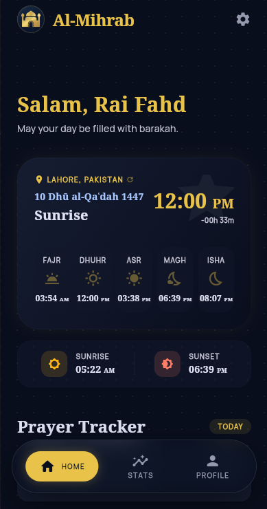
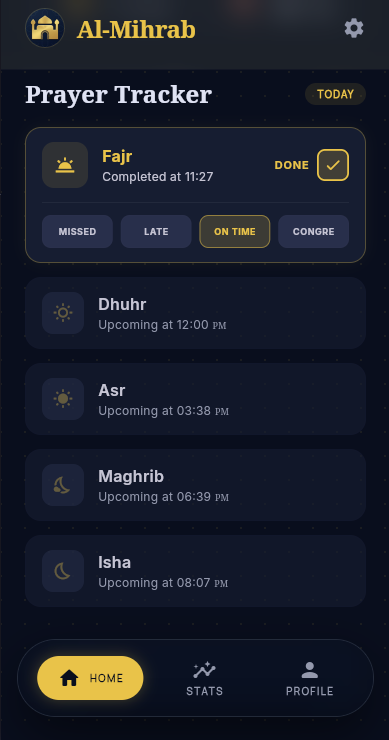
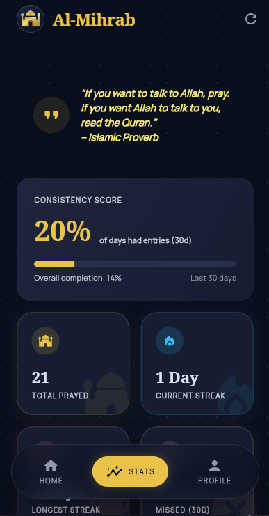
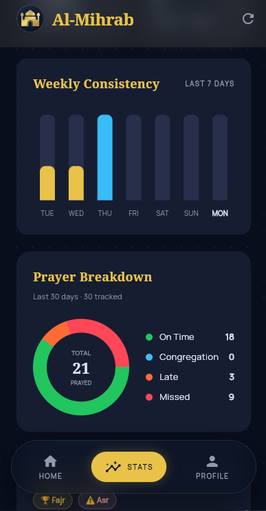
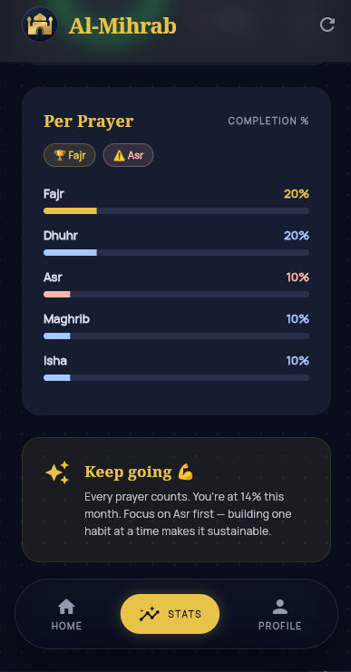
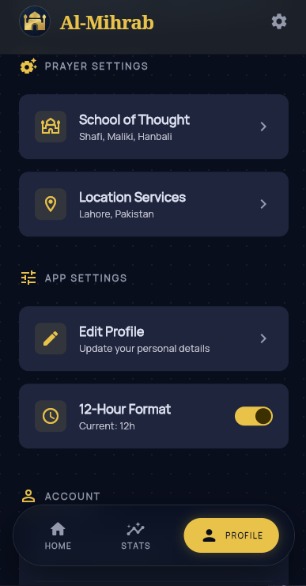

# Al-Mihrab: Salah Tracker
## Your Spiritual Accountability Companion

 

> *"Indeed, prayer has been decreed upon the believers a decree of specified times."* — Surah An-Nisa, 4:103

---

## Overview

**Al-Mihrab** is an open-source Islamic prayer tracker that uses **guilt-driven psychology** to motivate consistent prayer habits in Muslims around the world. Numerous Muslims struggle to maintain prayer consistency, and generic reminders don't work. Therefore, this app sends emotionally resonant notifications to create accountability and psychological motivation.

**Problem**: Muslims struggle with prayer consistency; generic reminders don't work. **Solution**: Streak tracking, guilt-based notifications, analytics, and cloud sync.

---

## Screenshots

### Home & Dashboard

  
  

### Statistics & Analytics

  
  
  

### Profile Management

  
  

---

## Key Features

| Feature | Details |
|---|---|
| **GPS Prayer Times** | Auto-detects location, multiple calculation methods, all 5 daily prayers |
| **Prayer Logging** | On Time / With Congregation / Late / Missed status tracking |
| **Streak Tracking** | Current streak, longest streak, per-prayer streaks for motivation |
| **Guilt Notifications** | Escalating accountability reminders with streak references |
| **Analytics** | Weekly/monthly charts, per-prayer analysis, progress tracking |
| **Secure Accounts** | JWT auth, bcrypt encryption, cloud sync across devices |

---

## Tech Stack

**Frontend**: Flutter 3.11+ • Provider 6.1+ • Dio 5.9+ • Firebase 3.0+ • Geolocator 14+ • Shared Preferences 2.5+

**Backend**: Node.js 18+ • Express.js 5.2+ • MongoDB 4.4+ • Mongoose 9.4+ • JWT 9.0+ • bcryptjs 3.0+ • Swagger 6.2+

---

## Design Decisions

| Decision | Why | Trade-off |
|---|---|---|
| **Guilt Notifications** | Emotional resonance drives behavior change better than neutral pings | Some users may find it harsh initially |
| **Streak Gamification** | Loss-aversion psychology creates self-reinforcing prayer habit loop | May feel game-like to purists |
| **Provider State Mgmt** | Lightweight, performant, minimal boilerplate, great community support | Limited features vs alternatives |
| **Separate Frontend/Backend** | Independent scaling, multi-platform support, better security | Higher initial complexity |
| **MongoDB** | Flexible schema for semi-structured prayer logs, easy horizontal scaling | Less ACID guarantees than PostgreSQL |
| **GPS Auto-Detection** | Seamless experience, supports travel, reduces friction | Battery drain risk (mitigated by caching) |

---

## Key Challenges Solved

1. **Prayer Time Accuracy**: Integrated multiple calculation methods (Hanafi, Shafi'i, etc.). Lesson: Religious apps require higher precision standards.

2. **GPS Battery Drain**: Location cached 24 hours, network-based fallback. Result: Minimal impact with maintained accuracy.

3. **Notification Reliability**: FCM + server-side scheduling + local fallbacks. Trade-off: Can't guarantee OS-level delivery, but significantly improved.

4. **Offline State Sync**: Optimistic UI updates + local queueing + conflict resolution via timestamps. Result: Seamless offline experience without data loss.

5. **Midnight Edge Cases**: UTC timestamps + timezone-aware streaks reset at local midnight. Lesson: Timezones are complex—invest in edge case testing.

6. **Culturally Sensitive Notifications**: Tested with Islamic scholars, varied tone, referenced Quran/Hadith. Result: Users report notifications feel "spiritually motivating."

---

## Limitations & Future Work

**Current Limitations**: 
- Notifications not guaranteed (OS restrictions)
- GPS accuracy varies by location  
- No offline logging yet
- English-only interface
- Single user per device

**Priority 1: Notification System (Planned)**
- Escalating urgency (+5min, +15min, +30min reminders)
- Smart timing (avoid work hours, batch notifications)
- Voice notifications + Adhan option
- Intelligent DND respect

**Other Priorities**: Community features • Offline queueing • Advanced analytics • Social accountability • Multi-language • Wearables • Mosque finder

---

## API Documentation

The backend provides a comprehensive REST API for all features:

- **Authentication** (`/api/auth`) — User registration and login
- **Prayers** (`/api/prayers`) — Prayer tracking and logging
- **Users** (`/api/users`) — User profile management
- **Utilities** (`/api/utilities`) — Prayer times and calculations

Full API documentation available at `/api/docs` when the server is running.

---

## Why This App?

There are many prayer apps out there. Most are beautiful dashboards that you open once, feel good about, and forget.

Al-Mihrab is different because it **comes to you** — with notifications that don't let you forget, with a streak that hurts to lose, and with an honest log that shows you exactly how consistent you really are.

The app doesn't judge you. But it does hold up a mirror.

And sometimes, that's all it takes.

---

## Contributing

Contributions are welcome. Please feel free to submit issues and pull requests.

---

## License

This project is open source and available under the MIT License.

---

## Acknowledgments

- Built for the Muslim community with sincere intentions
- May this app help strengthen the spiritual practice of Salah
- May it be a source of continuous good (Sadaqah Jariyah)

---

  Built with sincerity. May Allah accept it from you. 

